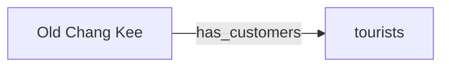
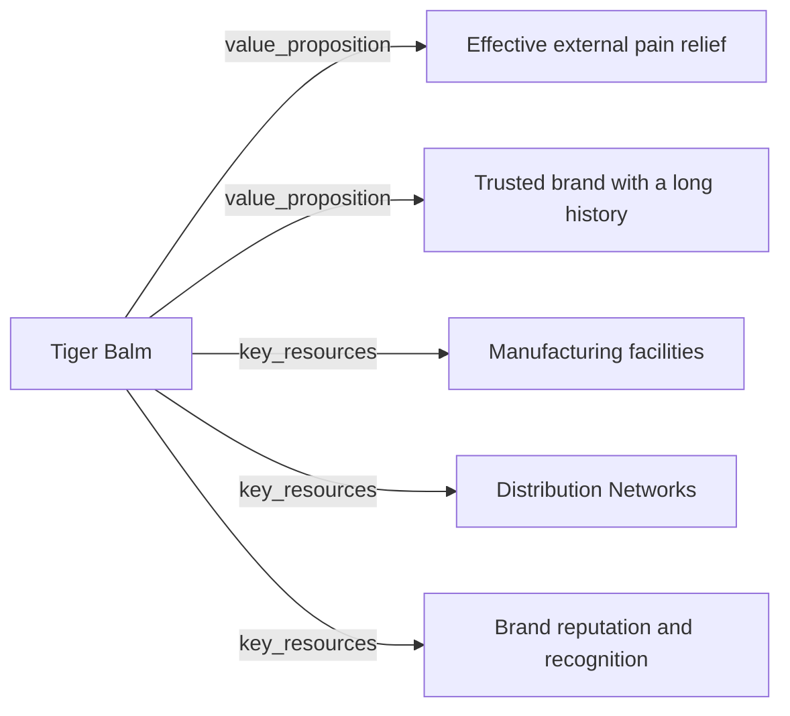
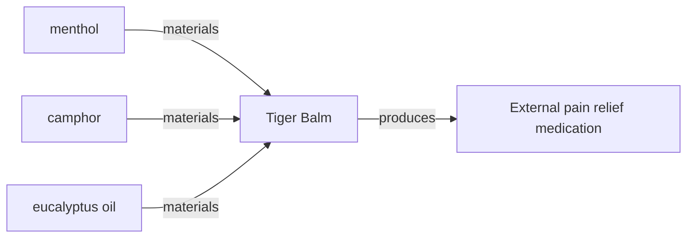
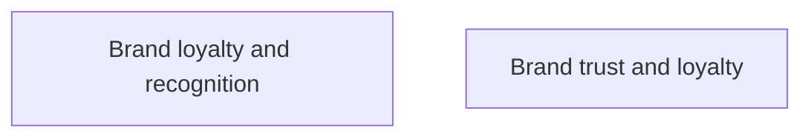
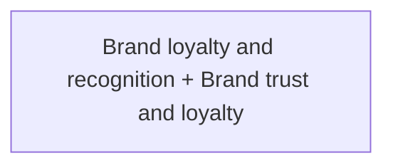
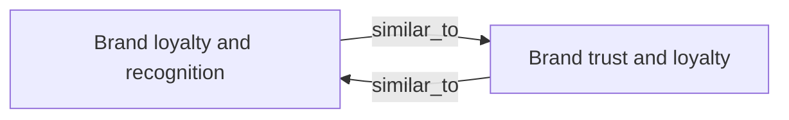

# EnterpriseSG Forward Deployed Team - we do some graph stuff too

We work with industry data, usually at a firm-level:
- use `Neo4j` to show company ownership graphs on a custom front end for our officers
- use `petgraph` for high throughput graph analytics to deliver "group" level metrics 

# knowledge graphs 101

Knowledge graph - a graph of data intended to accumulate and convey knowledge of the real world. Nodes usually represent entities/concepts of interest and whose edges represent relations between these entities.

https://neo4j.com/blog/what-is-knowledge-graph/
![[Pasted image 20240508135230.png]]

### Why are graph structures useful?
 https://arxiv.org/pdf/2003.02320

1. Graphs provide a concise and intuitive abstraction for a variety of domains, where edges capture the (potentially cyclical) relations

2. Graphs allow maintainers to postpone the definition of a schema, allowing the data – and its scope – to evolve in a more flexible manner than typically possible in a relational setting, particularly for capturing incomplete knowledge

3. Specialized graph query languages support not only standard relational operators (joins, unions, projections, etc.), but also navigational operators for recursively finding entities connected through arbitrary-length path

4. Opens up the possibility to apply graph analytics/ML directly on the graph data structure (centrality, community detection, connectivity, node similarity, link prediction)

When building this prototype I found that 1 and 2 have some truth. I did not go far enough to dig into 3 and 4.

# DIY Knowledge Graphs

Langchain and Neo4j both provide tooling that promises to help you do this. 

We won't use them...

# 0. What kind of questions?

1. I want to know the business model of a company at a glance. What does the firm depend on? What does it produce? Who are its partners?

2. I want to find all companies that have a particular characteristic. These are qualitative characteristics that are not stored in some nice RDB.

3. I want to match companies and help build partnerships between companies. What are the potential opportunities between company A and company B.

4. What are the clusters of companies in a certain sector? What characteristics do they share? Maybe I can design a grant scheme to better target such clusters. 

# 1. Data selection and ingestion

A small sample of company reports. For simplicity it is one report per company.

```
charles_and_keith.md
old_chang_kee.txt
secret_lab.md
tiger_balm.md
ya_kun_kaya_toast.txt
```

# 2. Extraction

The idea is to get semantic triples. You can use NER and other techniques to do this.




Or you can have an LLM do it for you.  I think this is sensible in the early stages of a project because this keeps our extractor step very flexible and easy to modify.

A very mediocre prompt
```
"Extract all semantic triples from the given text. Semantic triples consist of subject-predicate-object relationships. For example, [Eiffel Tower - was designed by - Gustave Eiffel]."
```

Target text
```
Charles & Keith Pte. Ltd., styled as CHARLES & KEITH and also known as C&K, is a Singaporean fashion house label founded in 1996, specializing in footwear, handbags and fashion accessories. Based in Singapore, the brand has a global footprint, operating more than 600 stores worldwide across 37 countries
```

Output - noisy, difficult to use?
```
1. [Charles & Keith Pte. Ltd. - is styled as - CHARLES & KEITH]
2. [Charles & Keith Pte. Ltd. - is known as - C&K]
3. [Charles & Keith Pte. Ltd. - was founded in - 1996]
4. [Charles & Keith Pte. Ltd. - specializes in - footwear, handbags, and fashion accessories]
5. [Charles & Keith Pte. Ltd. - is based in - Singapore]
6. [brand - has - global footprint]
7. [brand - operates - more than 600 stores worldwide]
8. [brand - operates - across 37 countries]
```

### Improving this extractor

Think about ontologies - it plays the role of the "schema" that the data should comply to.

![[Pasted image 20240508103529.png]]
https://www.researchgate.net/figure/Knowledge-Graph-Ontology-outlining-the-relationships-among-relevant-policy-entities_fig2_357953430

LLMs have probably seen a ton of **business model canvases/documents**, this is a good thing for us. There may be other such well-known ontologies in your domain that you can exploit.

New system prompt
```
"You are a helpful assistant designed to read documents about a company and output their business model canvas in a specific JSON format. The following JSON is an example output that is expected. In some cases, the lists could be empty if there is no relevant information available from the provided text.
      {
          "value_propositions": [
            "Effective external pain relief",
            "Trusted brand with a long history"
          ],
          "key_resources": [
            "Formulation expertise",
            "Manufacturing facilities"
          ],
          "key_activities": [
            "Distribution and sales"
          ],
          "key_partnerships": [
            "Suppliers of raw materials",
            "Distributors and retailers worldwide",
            "Regulatory agencies for compliance"
          ],
          "customer_segments": [
            "Consumers seeking external pain relief",
            "Healthcare professionals recommending topical analgesics",
            "Athletes and sports enthusiasts"
          ],
          "channels": [
            "Retail stores",
            "Pharmacies and drugstores",
            "Healthcare facilities"
          ],
          "customer_relationships": [
            "Brand trust and loyalty"
          ],
          "revenue_streams": [
            "Sales of Tiger Balm products",
            "Licensing and franchising",
            "Product variations and special editions",
            "Advertising revenue"
          ],
          "cost_structure": [
            "Raw materials procurement (menthol, camphor, eucalyptus oil)",
            "Manufacturing expenses",
            "Marketing and advertising costs",
            "Distribution and logistics",
            "Regulatory compliance"
          ]
      }
"
```

This output deserializes perfectly into this struct!  

```Rust
#[derive(Deserialize, Debug, Clone)]
pub struct ExtractionModel {
    value_propositions: Vec<String>,
    key_resources: Vec<String>,
    key_activities: Vec<String>,
    key_partnerships: Vec<String>,
    customer_segments: Vec<String>,
    channels: Vec<String>,
    customer_relationships: Vec<String>,
    revenue_streams: Vec<String>,
    cost_structure: Vec<String>,
}
```

```Rust
let body = json!({
	"model": "gpt-3.5-turbo",
	"messages": [
		{
			"role": "system",
			"content": extraction_prompt
		},
		{
			"role": "user",
			"content": input
		}
	],
	"temperature": 0.0,
	"response_format": { "type": "json_object" }
});

let response = client
	.post("https://api.openai.com/v1/chat/completions")
	.json(&body)
	.send()
	.await?;

...

let model = serde_json::from_str::<ExtractionModel>(...)?;
```

Restricting your response format to `json_object` is quite useful.

Use deserialization techniques to ensure type and field checking when you convert the `json_obect` into your struct/class. This reduces the risk of hallucation introducing errors into your graph structure.

The output of this extraction is enough to construct a subgraph that looks something like this. We already have a very rich model of this companies business model. 



We've chosen to restrict the ontology to only a few edge types.
- value propositions
- key resources
- key activities
- key partnerships
- customer segments
- channels
- customer relationships
- revenue streams
- cost structure

But you can experiment with more complex extraction models. For example this is an input-output view of a firm. Imagine this subgraph with other companies that supply chemicals, we might be able to create a supply chain model.



# 3. Resolution

We now have a number of subgraphs that are probably disconnected; the likelihood that they are joined at some leaf node is very slim. We need to stitch this up into a knowledge graph.



Option 1: use some type of entity resolution to merge related entities (multiple nodes being resolved to the same node)



Option 2: create new edges to link similar entities



These options are not mutually exclusive (and probably not collectively exhaustive).

I used option 2 - which is to link nodes (using their text embedding) with a minimum cosine similarity.  This leaves room for customization and optimization:
- conditional linking?
- bidirectional or single direction linking?
- differentiated edge type instead of a blanket edge `similar_to`
- how about clustering techniques?

`find_n_closest` - is a stand in for your favorite flavor of ANN search. 

```Rust
pub fn post_process_linking(&mut self, n: usize, min_similarity: f32) {
	for (target_node, embedding) in &self.embeddings_map {
		// iterate through every node in the embedding map
		let similar_nodes: Vec<_> = search::find_n_closest(...);

		(...)

		if let Some(target_node_index) = self.node_map.get(target_node) {
			// iterate to link all similar node indices that were found
			for similar_node_index in &similar_node_indices {
				// create link - but avoid self loops
				if target_node_index != similar_node_index {
					self.graph.update_edge(
						*target_node_index,
						*similar_node_index,
						"similar_to".to_string(),
					);
				}
			}
		}
	}
}
```

A nice side effect is that I now have a vector index on some nodes. Which allows me to pivot to using RAG ideas. 

# 4. Using the knowledge graph


### Type 1 - Retrieving data on a specific entity

"Tell me about the business model of Charles & Keith"

The most basic use case, we didn't even need to use the graph to get this. 

```Rust
let all_paths: Vec<Vec<NodeIndex>> = self.graph.neighbors_directed(...)...;
```


### Type 2 -  Search & Retrieval

"I'm launching a new digital solutions grant, which companies can I market this to?"

some other examples: "halal certification" / "material procurement" / "manufacturing expertise"

```Rust
let starting_nodes = self
	.find_relevant_nodes(text, openai_client, n, min_similarity)
	.await?;
```

```Rust
// idea is to find reachable entities through a dfs with selective pruning
depth_first_search(&self.graph, Some(start_node_index), |event| {
	match event {
		DfsEvent::Discover(node_index, _) => {
			let node = self.graph.node_weight(node_index).unwrap();
			if node.node_type == NodeType::Entity {
				entities_found.insert(node_index);
				
				Control::<NodeIndex>::Prune
			} else {
				Control::Continue
			}
		}
		_ => {Control::Continue}
	}
});

...
```

Take the query - embed it and find the most relevant nodes to start DFS. 

This looks a bit like RAG. But I feel like the output is more explainable + I can also use the edges/nodes along to path to pick up even more context

```
Manufacturing facilities > similar_to > Manufacturing facilities in China > key_resources > secret_lab
```

Additionally - we can control the DFS to implement things like WHERE / NOT to create interesting traversal patterns. This is an interesting example:

*"Companies that supply raw materials to aerospace companies but are not affiliated to other China-owned companies."*


### Type 3: Link discovery between entities

"What are the potential partnerships that we can facilitate between Old Chang Kee and Tiger Balm?"

```Rust
let paths = all_simple_paths(&self.graph, start, goal ...).collect::<Vec<Vec<_>>>();
```

```
old_chang_kee > cost_structure > Marketing and advertising expenses > similar_to > Marketing and advertising > key_activities > tiger_balm
```


### Type 4: Whole of Graph (WOG)

"What do companies in the food manufacturing sector require? What are the common channels employed by such companies?" (clustering?)

"Which manufacturing companies have niche capabilities?" (connectivity analysis)

"Which companies are likely to have e-commerce operations in China?" (link prediction)


# Final Points

Very tight coupling between extraction, graph generation, traversal modules. Changing extraction models can lead to huge downstream changes in how a graph must be traversed. Today's frameworks might not be able to handle this gracefully. 

Lots of experimentation required to create the right level of detail in an ontology - getting the business questions right is important. 

A knowledge graph seems to "compress" information. 